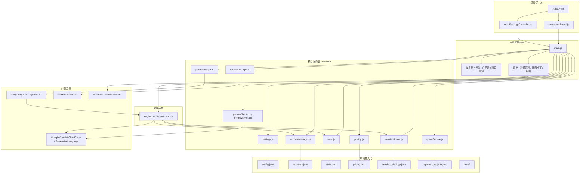
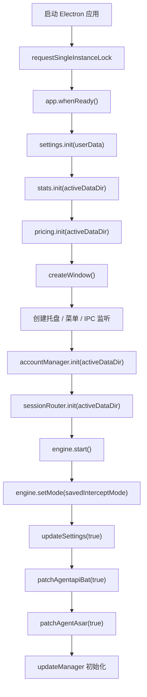
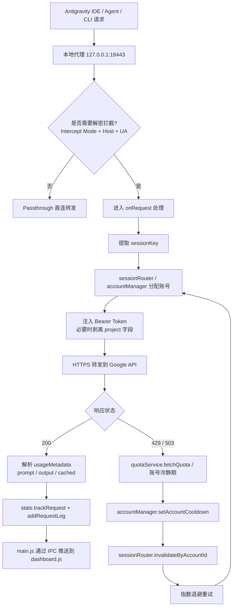
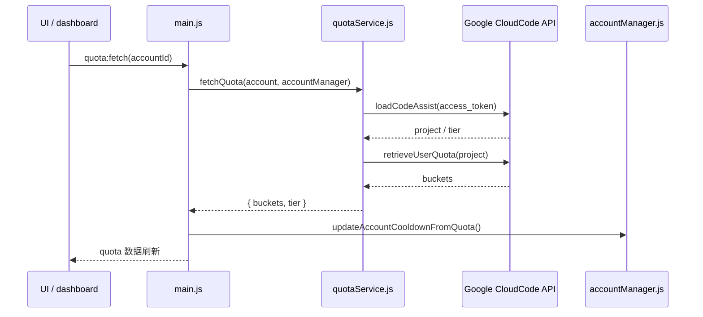
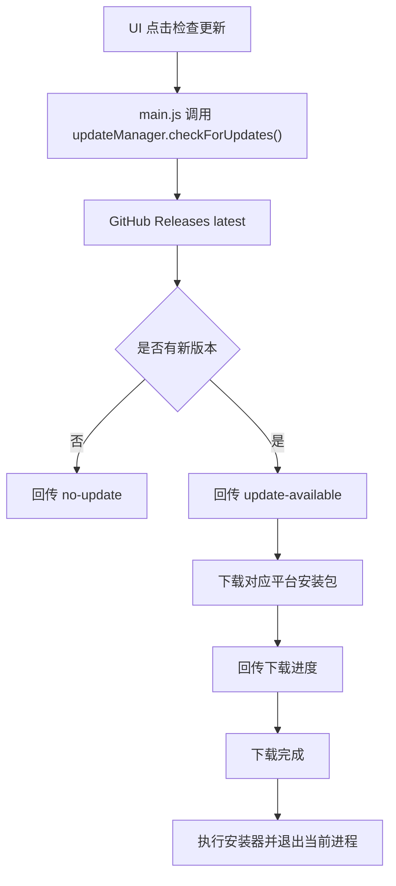

# Antigravity Proxy Desktop 系统流程说明

> 本文档基于当前代码实现梳理，目标是把项目的整体架构、核心模块职责、主流程和关键交互路径讲清楚，便于后续维护、扩展和交接。

## 1. 项目定位

Antigravity Proxy Desktop 是一款基于 Electron 的本地代理桌面客户端，核心目标是：

- 拦截并转发 Antigravity IDE / Agent / CLI 的 API 流量
- 对 HTTPS 请求进行本地解密、记录和统计
- 通过账号池和粘性会话路由实现稳定分流
- 自动处理配额耗尽、重试、冷静期和账号恢复
- 统一管理本地数据目录、证书、价格配置、请求日志和更新流程

---

## 2. 总体架构

---

## 3. 分层职责

### 3.1 主进程 `main.js`

主进程是整个系统的控制中心，负责：

- 单实例锁，避免重复启动
- 创建主窗口和系统托盘
- 初始化设置、统计、价格、账号池、会话路由
- 启动代理引擎
- 维护 IPC 通道，响应 UI 操作
- 安装 / 卸载证书
- 更新外部 Antigravity 安装内容
- 管理软件更新

### 3.2 代理引擎 `engine.js`

代理引擎是数据面核心，负责：

- 监听本地端口 `127.0.0.1:18443`
- 对 CONNECT 请求做分流
- 对目标流量进行 HTTPS 解密或直通转发
- 识别请求模型、项目、会话 ID
- 在账号池模式下注入 Bearer Token
- 对 `429 / 503 / ECONNRESET` 等错误做重试
- 解析响应中的 token 使用量并上报统计

### 3.3 核心服务层 `src/core`

- `settings.js`：管理配置和数据目录迁移
- `accountManager.js`：账号持久化、启用禁用、冷静期、分配策略
- `sessionRouter.js`：会话粘性路由与持久化绑定
- `stats.js`：请求日志、趋势图、Token 和成本统计
- `pricing.js`：模型定价和成本计算
- `quotaService.js`：账号配额查询、token 刷新、project 捕获
- `geminiCliAuth.js` / `antigravityAuth.js`：OAuth 登录
- `updateManager.js`：GitHub 版本检查、下载、安装
- `patchManager.js`：代理环境注入和外部应用补丁

### 3.4 渲染层 `src/ui`

- `dashboard.js`：主仪表盘，展示状态、日志、图表、账号、配额、价格、更新
- `settingsController.js`：设置页逻辑，负责系统日志、自启动、静默启动、关于页

---

## 4. 启动流程

### 启动阶段的关键动作

- 读取 `config.json`，决定当前使用默认数据目录还是自定义目录
- 同步加载 `stats.json`、`pricing.json`、`accounts.json`、`session_bindings.json`
- 启动代理引擎并恢复上次的拦截模式
- 将 IDE / Agent / CLI 的请求强制导向本地代理
- 创建托盘，关闭窗口后转为后台驻留
- 初始化更新管理器，接收 GitHub Release 事件

---

## 5. 核心请求流程

### 5.1 CONNECT 分流

代理引擎先判断目标连接是否满足以下条件：

- 当前处于拦截模式
- 目标主机是 Google 的相关 API 域名
- User-Agent 符合 Antigravity / Go 客户端特征

满足条件时进入解密代理，否则走直通隧道。

### 5.2 请求重写

请求进入解密路径后，会执行以下处理：

- 提取请求体中的 `project`
- 通过会话路由器提取稳定 `sessionKey`
- 在账号池开启时选择可用账号并注入 `Authorization: Bearer ...`
- 对 JSON 请求剥离 `project` 字段，降低默认项目触发配额异常的概率
- 把请求转发到真实 Google 服务端

### 5.3 响应处理

响应返回后，会：

- 解析 `usageMetadata` 中的 token 统计
- 调用 `stats.trackRequest()` 计算成本
- 调用 `stats.addRequestLog()` 生成结构化日志
- 通过 IPC 将最新统计回传 UI

### 5.4 失败重试

若返回 `429` 或 `503`，会进入：

- 配额查询
- 账号冷静期设置
- 会话绑定失效
- 指数退避重试

这样可以减少单一账号或单一会话持续撞限额的概率。

---

## 6. 账号池与粘性会话

### 6.1 账号登录

账号登录分为两条路径：

- `geminiCliAuth.js`：Gemini CLI OAuth
- `antigravityAuth.js`：Antigravity OAuth，并尝试激活 project

登录成功后会写入 `accounts.json`，并进入账号池。

### 6.2 粘性路由

`sessionRouter.js` 的目标是让同一 IDE 会话尽量始终命中同一个账号，避免上下文缓存丢失。

核心策略：

- 优先使用 `Authorization Bearer Token` 作为基础会话键
- 再结合请求体中的 `requestId` 细化会话粒度
- 优先分配空闲账号
- 如果所有账号都已有绑定，则走一致性哈希
- 会话绑定会持久化到 `session_bindings.json`
- 30 分钟无活动的会话会自动清理

### 6.3 冷静期与失效

当某个账号被判定配额耗尽时：

- `accountManager.setAccountCooldown()` 会设置冷静期
- 关联会话会被 `sessionRouter.invalidateByAccountId()` 作废
- 后续请求会重新分配到其他账号

---

## 7. 配额查询流程

### 7.1 查询步骤

`quotaService.js` 的主流程是：

1. 调用 `loadCodeAssist` 获取 project
2. 如果 token 失效，使用 refresh token 刷新
3. 调用 `retrieveUserQuota` 或 `retrieveUserQuotaSummary`
4. 解析 bucket 列表
5. 回写账号冷静期和订阅级别

### 7.2 project 捕获

代理引擎会从请求体中捕获 `project`，并通过 `quotaService.setCapturedProject()` 写入 `captured_projects.json`，后续配额查询会优先复用本地缓存。

---

## 8. 统计与计费

### 8.1 统计

`stats.js` 负责：

- 总请求数
- 输入 token
- 输出 token
- 缓存 token
- 总成本
- 模型维度统计
- 按小时趋势图
- 最近 50 条结构化请求日志

### 8.2 计费

`pricing.js` 负责把模型名称映射到对应的单价，并提供：

- `calculateCost()`
- `getPricingForModel()`
- `updateModelPricing()`
- `resetPricingToDefault()`

统计模块在记录请求时会调用计费模块，把 token 消耗转换成实际成本。

---

## 9. 数据目录与持久化

当前核心数据默认存放在 Electron 的 `userData` 目录，也支持通过设置迁移到自定义目录。

### 9.1 常见文件

- `config.json`
- `accounts.json`
- `stats.json`
- `pricing.json`
- `session_bindings.json`
- `captured_projects.json`
- `certs/`

### 9.2 数据迁移

当用户更改数据目录时，`settings.migrateData()` 会：

- 停止代理
- 复制核心数据文件
- 复制证书目录
- 校验目标文件是否写入成功
- 更新运行时路径
- 重新 patch 外部程序
- 重启代理

---

## 10. 外部补丁与代理注入

`patchManager.js` 负责两类动作：

- 给 Antigravity Agent 的 `app.asar` 注入代理环境变量
- 给 `agentapi.bat` 或 shell 启动脚本注入 `HTTP_PROXY` / `HTTPS_PROXY`

目的很明确：

- 让 IDE 本体流量走本地代理
- 让 CLI / language server 也走本地代理
- 保证整个工具链的请求入口统一

---

## 11. 更新流程

`updateManager.js` 只做三件事：

- 检查最新版本
- 下载匹配平台的安装包
- 启动安装器并退出

---

## 12. IPC 事件总览

### 12.1 UI -> 主进程

- `get-state`
- `toggle`
- `cert-install`
- `cert-uninstall`
- `get-pricing`
- `update-pricing`
- `delete-pricing`
- `reset-pricing`
- `accounts:get`
- `auth:login`
- `accounts:remove`
- `accounts:toggle-enabled`
- `pool:toggle`
- `pool:clear-sessions`
- `quota:fetch`
- `settings:get-dir-sync`
- `settings:change-dir`
- `settings:set-system-log-enabled`
- `settings:set-auto-start`
- `settings:set-silent-start`
- `app:check-for-updates`
- `app:start-download-update`
- `app:install-update`
- `app:get-version`

### 12.2 主进程 -> UI

- `state`
- `stats-updated`
- `log`
- `cert-status-res`
- `accounts-res`
- `get-pricing-res`
- `settings:migration-progress`
- `app:update-available`
- `app:update-not-available`
- `app:download-progress`
- `app:download-complete`
- `app:update-error`
- `memory-stats-updated`

---

## 13. 前端页面职责

### 13.1 `dashboard.js`

主仪表盘负责：

- 读取代理状态
- 切换拦截模式
- 展示日志、统计、趋势图、价格表
- 管理账号列表与负载均衡开关
- 发起配额刷新
- 处理数据目录切换
- 处理更新下载和安装

### 13.2 `settingsController.js`

设置控制器负责：

- 系统日志开关
- 开机自启动
- 静默启动
- About 页面外链

---

## 14. 设计特点

- 单实例运行，避免多开冲突
- 主进程与渲染进程通过 IPC 解耦
- 账号池与会话路由分离
- 配额状态和统计数据持久化
- 支持数据目录迁移
- 支持外部程序代理注入
- 支持自动更新

---

## 15. 总结

这个项目本质上是一个“本地代理编排中心”：

- 前端负责可视化控制
- 主进程负责生命周期和系统级动作
- 代理引擎负责流量接管
- 核心模块负责账号、会话、配额、统计、价格、更新和迁移

如果要继续演进，这个架构已经具备比较清晰的边界，后续可以继续把 `src/core` 按“账号域、计费域、配置域、更新域”进一步拆细。
